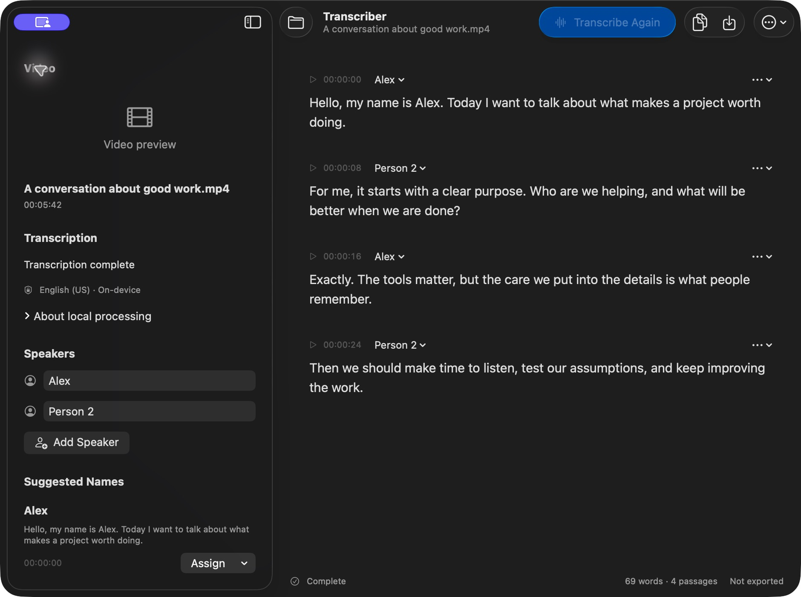

# Transcriber for Mac

A native macOS workspace for turning an MP4 into an editable English transcript. Built with Swift 6, SwiftUI, AppKit, AVFoundation, Natural Language, and Apple's on-device Speech framework. No third-party dependencies, cloud transcription, or API keys.



[View the Light Mode screenshot](docs/studio-light.png). Screenshots use synthetic example text.

The interface follows the Mac's appearance and accent color. A resizable, collapsible sidebar holds video playback and speaker tools. The toolbar keeps Open Video, Transcribe, Copy All, Save As, and Export Options available when the sidebar is hidden. Native Liquid Glass materials surround a plain transcript editor.

## Requirements

- Apple silicon Mac running macOS 26 or later.
- Xcode 26.6 or later to build. Local validation uses Xcode 27.0.
- English speech assets. macOS can download them on first use; subsequent transcription works offline with the assets installed.

## Build and run

```sh
bash Scripts/build.sh
open build/Release/Transcriber.app
```

Or open `Transcriber.xcodeproj` and run the Transcriber scheme on My Mac. The build produces the app, `Transcriber-macOS.zip`, checksums, and an implementation fingerprint in `build/Release`.

The default uses ad-hoc signing for personal use. For a stable local signing identity, copy `Config/Local.xcconfig.example` to `Config/Local.xcconfig` and configure your Apple Development identity. Private signing settings are ignored by Git. Distribution to others requires the separate procedure in [RELEASING.md](docs/RELEASING.md).

## Use the app

1. Open or drop an MP4. Choose an audio track if the video contains several.
2. Choose **Transcribe** in the toolbar. Completed passages appear as the video is processed. Cancellation keeps completed passages and labels the result incomplete.
3. Click a timestamp to seek the video. Edit passage text after processing finishes. Edits keep the original passage time range.
4. Add **Person 1**, **Person 2**, and other speakers in the sidebar, then assign them using each passage's speaker menu. Edit a speaker name in the sidebar; press Return or leave the field to commit.
5. Choose **Split at a Word** from a passage's action menu, select the first word of the new passage, then choose **Split Passage**. Splitting is available for unedited passages with complete timing. Restore original text from the same menu before splitting a corrected passage.
6. Name suggestions come from explicit spoken introductions. Assign a suggestion to a new or existing speaker after checking its source passage. These suggestions do not identify voices automatically.
7. Choose **Copy All** or **Save As** in the toolbar. The default filename is `<video basename> transcription.txt`. Use **Export Options > Include Timestamps** to add passage times to either output.

Drag the sidebar divider to adjust its width or use the toolbar's sidebar button to hide it. The bottom status area distinguishes transcription completion from text-file export. Autosave failures stay visible with a Retry action.

The app saves one current session on this Mac. Opening another video asks before replacing unexported work. Copying text does not count as saving a file. An interrupted transcription can be reviewed, exported, or restarted from the beginning. If the original video moves or access expires, the transcript stays available and **Locate original video** restores playback.

Keyboard shortcuts: Command-O opens a video, Command-R transcribes, Command-Period cancels transcription, Command-S saves text, and Command-Shift-C copies the transcript. Standard text editing shortcuts work within a passage.

## Privacy and reliability

The sandbox grants access only to files you select. No camera or microphone access is requested. The application has no network client or telemetry; macOS manages model downloads. Diagnostic messages do not include transcript content.

Session writes are atomic and versioned. Unreadable or newer-format sessions are protected until you explicitly preserve them and start fresh. An autosave failure remains visible and quitting offers a chance to recover or export your work.

Punctuation is normalized consistently in the interface and exported text. Source videos are never modified. Transcription accuracy depends on audio quality, language, accents, crosstalk, and Apple's installed model. Speaker separation is manual. Name suggestions are conservative and may omit names.

## Verification

```sh
bash Scripts/test.sh
bash Scripts/check-media.sh --speech
bash Scripts/check-storage.sh
python3 Scripts/check-content.py
```

Media checks synthesize speech and create disposable fixtures under `build`. They do not record a microphone or camera. Speech and media checks need access to normal macOS services in a logged-in session. CI checks compilation, unit tests, synthetic decoding, content, signatures, and package integrity; it does not substitute for human-speech or clean-user acceptance.

See [VALIDATION.md](VALIDATION.md) for measured results and remaining release gates, and [ARCHITECTURE.md](ARCHITECTURE.md) for implementation boundaries. This release must not be described as fully production-validated while required acceptance gates remain open.
